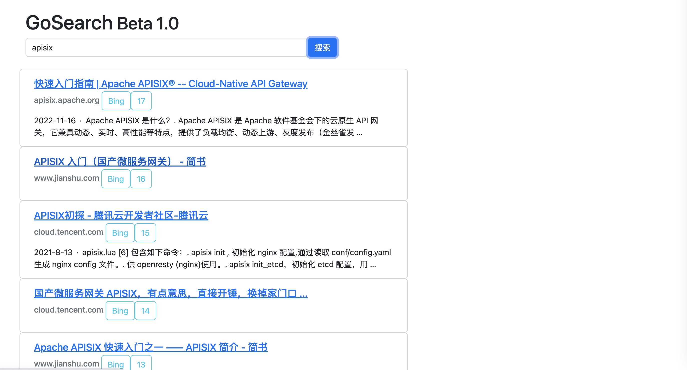

# GoSearch

## 项目介绍

聚合各大搜索引擎结果，显示合理广告位，不然抢生意了，哈哈！

[里程碑计划](note/roadmap.md)

[排序算法实现思路](note/algorithm.md)

**主要功能有：**

- 支持搜索引擎配置权重
- 支持域名配置权重
- 搜索引擎结果渲染优化

## 软件架构

采用go语言开发，前端和后端都在一个项目，转发请求到搜索引擎并对结果进行裁剪、聚合、展示。

**依赖组件：**

- goquery
- yaml.v2
- bootstrap5（因为页面简单，不需要独立部署前端服务）

## 使用说明

**启动**

``
go run main/hello.go 
``

**示意图**

## 参与贡献
- Fork 本项目
- 新建 Feat_xxx 分支
- 提交代码
- 新建 Pull Request
